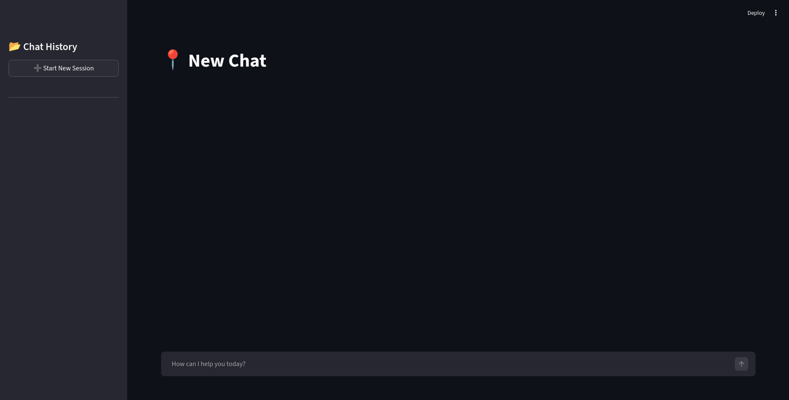
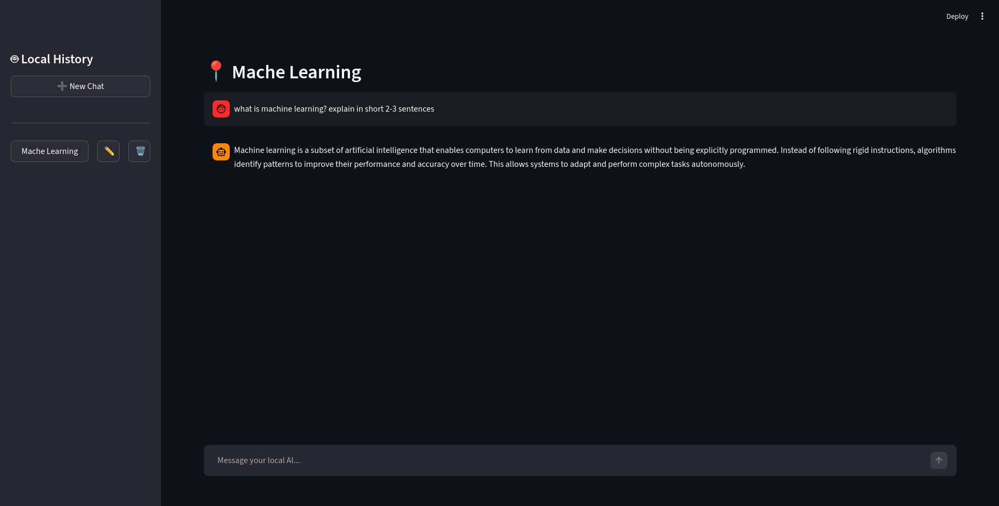
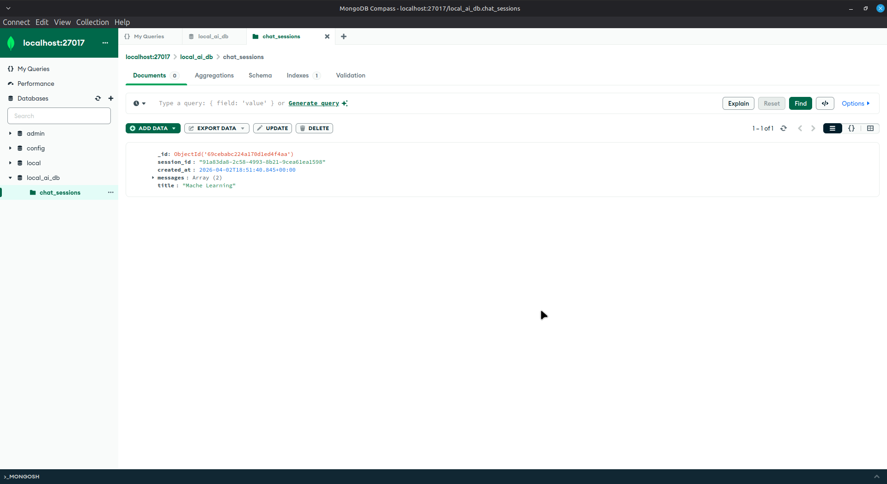

# Local AI Chat

Local AI Chat is a Python-based web application that allows you to chat with locally hosted AI models. Built with Streamlit for the frontend, it uses Ollama to run local LLMs and MongoDB to store and manage your chat history.

## Features

- Private Local Chat: Messages are processed on your local machine using Ollama.
- Chat History Management: Previous sessions are saved in MongoDB and visible in the sidebar.
- Auto-Generated Titles: Uses the local LLM to automatically generate concise titles for new chats.
- Session Management: Easily create, rename, or delete chat sessions.
- CPU-Optimized Setup: Includes logic to optimize context size for faster local inference.

## Setup Instructions

### Prerequisites
- Python 3.x
- MongoDB running locally or accessible via a network
- Ollama installed and running with your preferred model downloaded (default is qwen3.5:4b)

### Installation

1. Create and activate a virtual environment:
```bash
python3 -m venv chat_llm_venv
source chat_llm_venv/bin/activate
```

2. Install the required dependencies:
```bash
pip install -r requirments.txt
```

3. Create a .env file in the root directory to configure your MongoDB connection:
```env
MONGO_USER=your_username
MONGO_PASS=your_password
MONGO_HOST=localhost
MONGO_PORT=27017
MONGO_DB=local_ai_db
```

4. Run the Streamlit application:
```bash
streamlit run app.py
```

## Application Output

### Chat Interface




### Database Output

